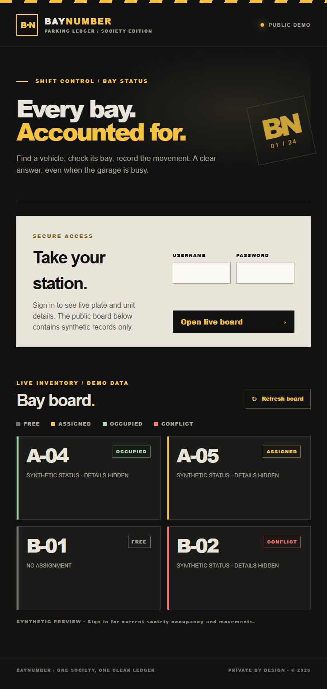
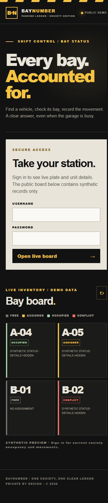

# BayNumber


A private parking-bay ledger for one apartment society. The phone-width guard board answers **which bay belongs to a vehicle** and **whether it is occupied now**. A secretary can create bays, change assignments, and export an audit trail. The public preview is entirely synthetic.





Signed-in synthetic guard views: [desktop](docs/screenshots/guard-board.png), [phone](docs/screenshots/guard-mobile.png), and [conflict feedback](docs/screenshots/conflict.png).

Watch the [30-second demo](docs/baynumber-demo-30s.mp4), made entirely with synthetic records.
To rebuild the H.264 clip from the checked-in demo captures, install [optional video dependencies](docs/requirements-video.txt) and run `python docs/render_demo_video.py`.

## Guard workflow

1. Sign in as guard. Search a plate to find its active bay, unit, and occupancy.
2. Tap **Record IN** when the assigned vehicle enters or **Record OUT** when it leaves. The server records an immutable event with actor and UTC time.
3. If the state conflicts, the action is rejected with a clear message and the card turns red. Refresh the board after other operators make changes.

Admins can create bay labels, assign a unit and plate, end an assignment after the vehicle is OUT, and download movement and assignment audit CSVs. A plate can have only one active bay; a bay can have only one active assignment.

## Windows setup

Install Python 3.12 and `uv`, then run in this repository:

```powershell
uv venv --python 3.12
uv pip install --python .venv\Scripts\python.exe -r requirements-lock.txt
uv pip install --python .venv\Scripts\python.exe -e . --no-deps
Copy-Item .env.example .env
```

Edit `.env` with a fresh 32+ character session secret and two distinct 12+ character passwords. Never commit it. Then:

```powershell
.venv\Scripts\python.exe -m baynumber.cli init-db
.\start.bat
```

Open `http://127.0.0.1:8000`. `start.bat` binds to localhost by default. Set `BAYNUMBER_SECURE_COOKIE=true` when served through HTTPS. The app does not automatically create a database; a missing database returns HTTP 503 with the setup command.

For a separate synthetic database, run `baynumber.cli demo-seed` and point `BAYNUMBER_DB` at `data/demo.db` for the demo session. Run `demo-reset` to delete only a database marked by the seed command. The reset refuses the real database path. Do not seed a real database.

```powershell
.venv\Scripts\python.exe -m baynumber.cli demo-seed
$env:BAYNUMBER_DB="data/demo.db"
.\start.bat
# In another shell, with the real BAYNUMBER_DB setting restored:
.venv\Scripts\python.exe -m baynumber.cli demo-reset
```

## Architecture and data

`baynumber/web.py` is the HTTP layer; `service.py` holds ledger rules; `db.py` opens SQLite and applies numbered migrations; `models.py` validates input. The browser uses a small static HTML/CSS/JS interface. SQLite foreign keys are enabled on every connection. Active assignment unique indexes prevent overlapping bay or plate ownership. `BEGIN IMMEDIATE` serializes writers, so simultaneous IN attempts cannot both succeed. Movement and assignment audit tables have database triggers that reject updates and deletes. Events are ordered by insertion ID for operational state; `occurred_at` is an entered event time and `recorded_at` is the audit time.

Passwords and the session signing key come only from environment variables or an untracked `.env` file. Sessions are signed, HttpOnly, SameSite=Strict cookies with eight-hour expiry. Browser writes require a CSRF token. This single-society build uses two environment-configured accounts; it has no self-service user management. Logs are structured JSON and omit plates and units.

The CSV headers are fixed. Movement events: `event_id,bay_label,unit,plate,kind,occurred_at_utc,recorded_at_utc,actor`. Assignment audit: `audit_id,assignment_id,action,occurred_at_utc,actor,bay_label,unit,plate`. Only admins can download them.

## Input and privacy

Bay labels allow ASCII letters, digits, and internal hyphens (for example `A-04`). Units allow letters, digits, spaces, slash, and hyphen. Plate input is normalized to uppercase with spaces and hyphens removed, then accepts 4–16 ASCII letters/digits containing both a letter and digit. This is an identifier check, **not** a claim to validate every Indian registration format. It accepts common permanent and BH-style patterns, and an admin can correct a mistaken plate by ending an unoccupied assignment and creating a new one. There is no resident name, phone, email, or contact field.

The public/demo board exposes synthetic states only; it does not fetch the real database or reveal plates or units. `demo-seed` stores synthetic values in a separate ignored SQLite file. No real records are included in this repository. Do not use a production database for screenshots, demos, or CI.

## Tests and release notes

```powershell
.venv\Scripts\python.exe -m pytest -q --basetemp=.pytest-tmp
```

Local verification on 2026-09-24: **5 passed**. The tests exercise clean create/assign/IN/OUT/export, a two-thread IN race, unique constraints, immutable events, rollback on rejected assignment ending, validation, CSRF and role permissions, CSV headers, synthetic preview, and missing database behavior. See [demo script](docs/demo-script.md) and [LinkedIn draft](docs/linkedin-draft.md).

Known gaps: no account rotation UI, rate limiting, automated backup/restore, or multi-device field test. For a real deployment, use HTTPS, restrict database file access, schedule backups, and add site-specific operating procedures before onboarding staff.

## License

BayNumber is released under the [MIT License](LICENSE). Copyright (c) 2026 Santhosh A.
